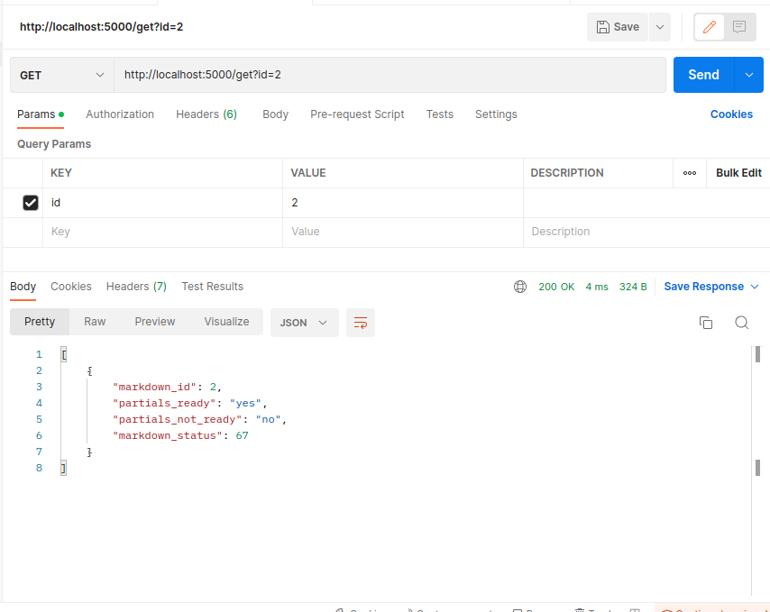
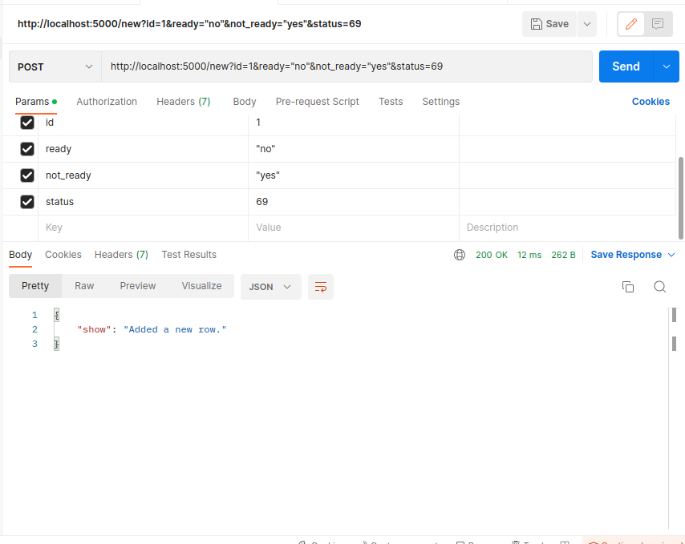
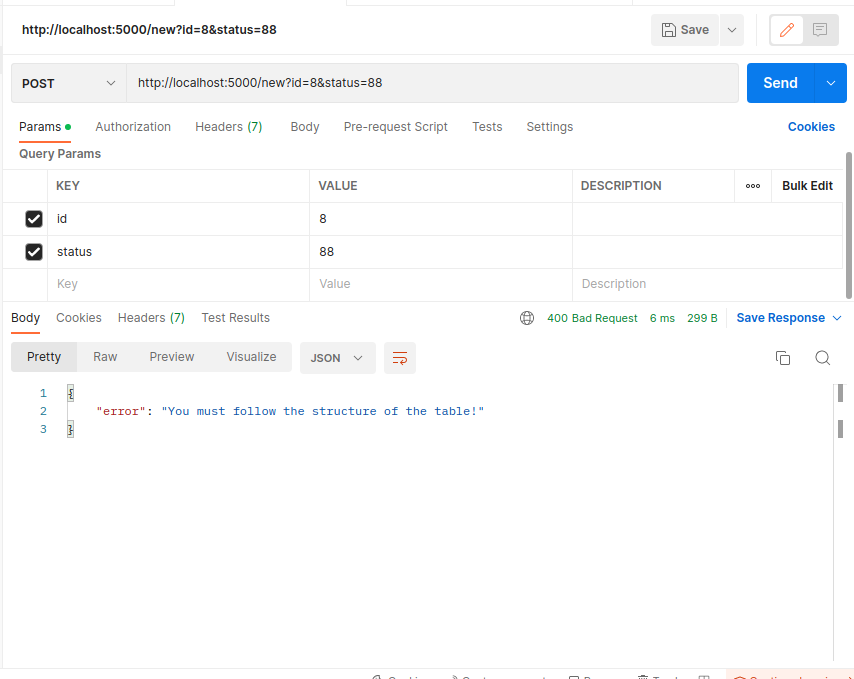
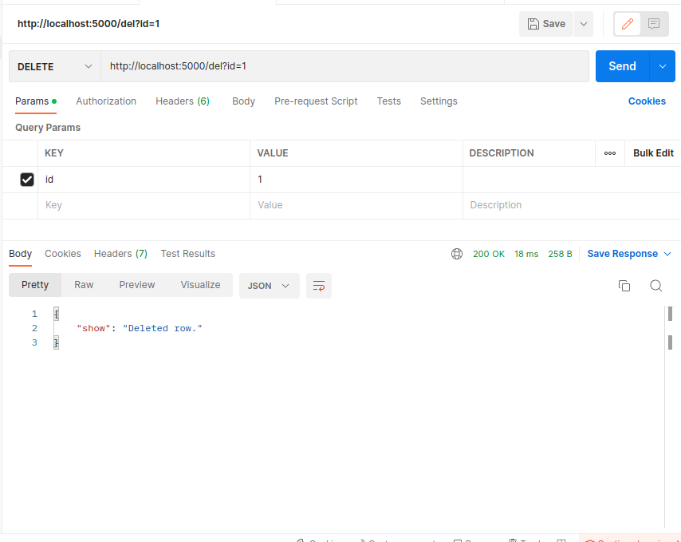
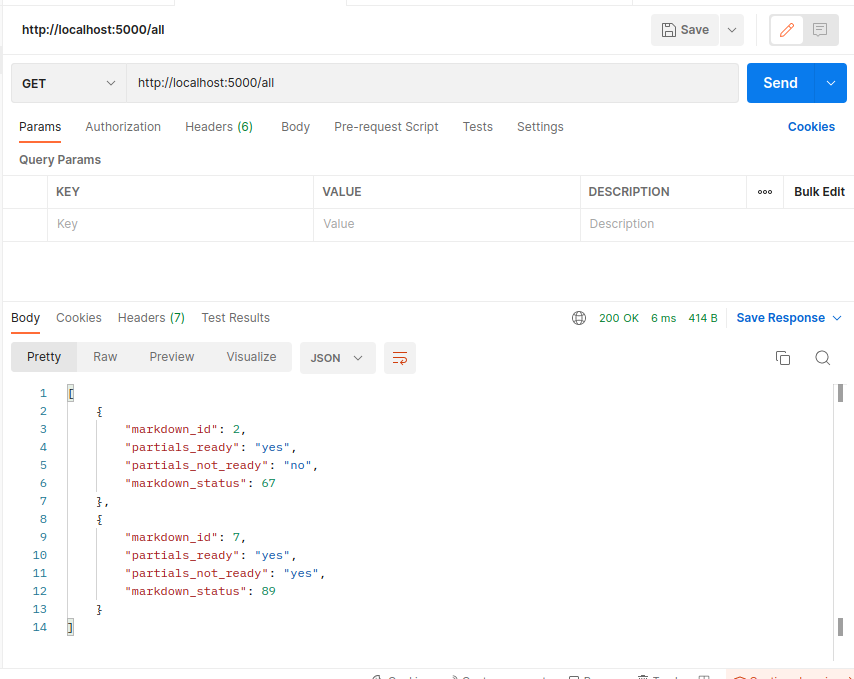

# Тестування працездатності системи

Використовувався Postman 

## Запит усіх рядків markdown_INTENTION:

  

## Запит рядка по id:

  

## POST запит - створення нового рядка

  

## POST запит - створення нового рядка з невірними даними

  

## PUT запит - зміна поля певного рядка

  

Результат:

  

## DELETE запит - видалення рядка

  

Результат:

  

